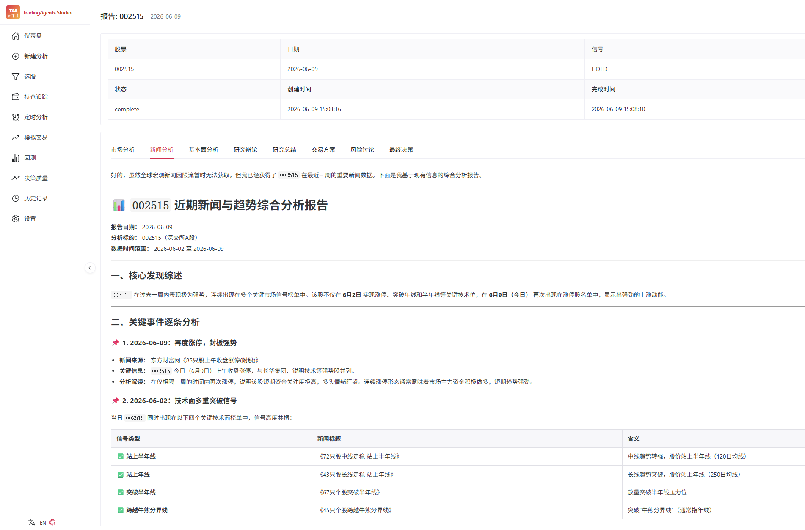
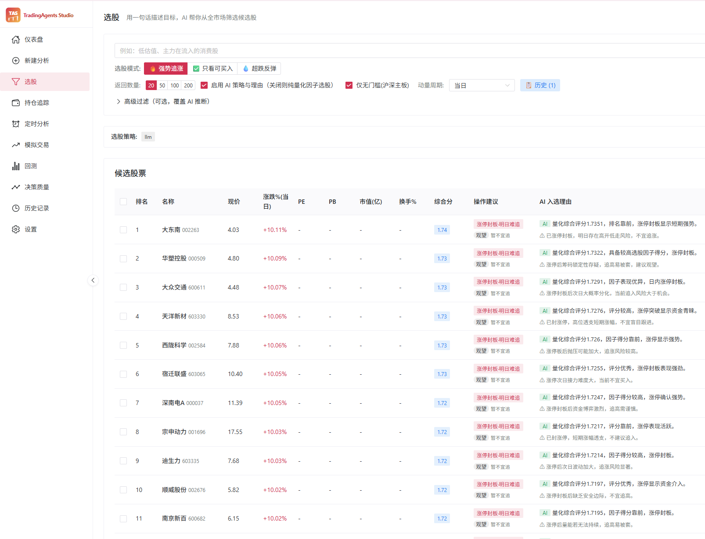

# TradingAgents-Studio

> **可视化多智能体 LLM 交易研究平台 — 看见 Agent 怎么想、怎么辩、怎么决策,而不是只看最后一个 BUY/SELL。**
>
> *A visual multi-agent LLM trading research workbench. Watch the agents debate, see the causal chain unfold, replay history with one click.*

[](LICENSE)
[](https://www.python.org/)
[](https://vuejs.org/)
[](https://fastapi.tiangolo.com/)

[English](README.md) | **简体中文**

> ⚠️ 仅供研究 / 教学用途。**不构成任何投资建议。** [完整免责声明 ↓](#免责声明--disclaimer)

---

<!-- TODO: 主视觉截图。建议:
     - 分析进度页运行中(辩论气泡实时流式刷新)
     - 或 30s GIF:自然语言输入 → 解析 → 分析 → 辩论 → 决策卡片
     建议路径: assets/screenshots/hero.png -->

<!-- screenshot:hero -->

---

## ✨ Studio 不一样在哪

### 🎯 看推理过程,而不是一堵 Markdown 墙

大多数 LLM 交易框架最终扔给你一堆长 Markdown 报告,让你自己滚动翻。
Studio **解析同样的报告**,把它们转成结构化可视化。

- **因果链卡片** — 事件分析师的输出会被拆成一张张事件卡:
  `事件 → 直接影响 → 供应链 → 板块情绪 → 个股`,
  以纵向链条渲染,卡片边框按情绪正负染色。

  
- **结构化新闻报告** — 新闻分析师的输出会被解析成「核心发现速读」+「关键事件清单」
  表格,每条事件标注利好 / 利空、权重和一句话含义,而不是一整段 Markdown。

  
- **多空双方变成对话** — 不再是两大段长文。
  左右气泡按轮次分割,标注角色,最新一轮带实时脉冲动画。
  风险辩论(激进 / 保守 / 中立)用三种颜色同样处理。
  <!-- screenshot:debate-bubbles -->
- **流式实时展示** — 进度页通过 WebSocket 订阅 `debate_turn` 事件,
  图运行的过程中对话**实时生长** —
  不只是"节点 X 已完成"这种时间线打点。

### 🇨🇳 A 股一等公民

从数据层开始就为中国市场而生,同时保留对美股 / 港股 / 全球市场的完整覆盖。

- **AKShare**(免费,默认) + **Tushare Pro**(可选付费兜底) —
  vendor 路由会**自动识别 A 股代码**(`6 位数字`、`.SS/.SH/.SZ`、
  `sh/sz` 前缀)并路由到 CN 数据链。无需手工切换。
- **4 个 A 股原生分析师**:
  - `cn_social` — 东方财富股吧散户讨论(纯 HTTP,无需鉴权)
    + 可选 微博/小红书/抖音(通过 [MediaCrawler](https://github.com/NanmiCoder/MediaCrawler))
  - `event` — LLM 推理因果链,无需关键词词典
  - `capital_flow` — 主力资金净流入 / 北向(沪深港通) / 融资融券 / 龙虎榜
  - `macro` — 自上而下宏观判断(CPI/PPI/M2/PMI/LPR/USDCNY/美债 10Y)
    映射到板块倾向
- **分钟级 K 线** 适配 A 股(1/5/15/30/60 分钟,通过 AKShare),
  交易时段每 30–60 秒实时刷新。

### 🛠 完整工作流,不只是一次推理

Studio 集成了研究工作台真正需要的肌肉:

| 功能 | 干什么用 |
|---|---|
| **自然语言入口** | "研究茅台短期" / "AAPL 30 天" → 自动填充代码 + 日期 + 周期。默认走规则解析(确定性、免费),可选 LLM 兜底。 |
| **选股 (Screener)** | 按因子打分(动量 + PE/PB/换手 + 资金流)对 A 股票池排序,并给出**确定性、识别板块规则的「操作建议」** —— 操作信号(好 / 观望 / 谨慎 / 避免)+ 今日/次日时点,会给一字涨停、过度拉升的票降权,让 Top-N 是真能买进的票,而不只是涨得最多的。不调 LLM、不靠关键词词典。选出的票可**一键交给 分析 / 模拟交易 / 定时分析**。 |
| **持仓追踪** | A 股 / 全球持仓,记录股数、成本、实时报价、盈亏,以及**每个标的最新一次分析信号**。CSV 导入兼容 代码/股数/成本价 等中文表头。 |
| **定时分析** | 间隔 / 每日 / 每周后台运行。分析师与 LLM 配置在创建时快照保留。连续失败 3 次自动停用,坏配置不会悄悄烧光你的额度。 |
| **模拟交易** | 虚拟账户、现金、持仓、每日 NAV 快照。**一键"按此决策模拟下单"** 会解析 trader proposal 的 Action + Entry/Target/Stop 并开一笔虚拟仓位。强制执行 A 股 T+1。 |
| **决策回放回测 (Decision Replay)** | 事件驱动的回测,在任意窗口内回放 Studio 已存储的 Agent 决策 —— 回答 *"如果我当时听了 Agent 的 Buy/Sell,现在净值会是多少?"*。**零 LLM 成本**,因为是历史回放。报告总收益、最大回撤、夏普、索提诺、胜率、盈亏比、相对基准的 alpha。每笔交易可回链到对应的源分析报告。 |
| **K 线面板** | 在持仓页或模拟交易页按标的弹出抽屉。日线 + 1/5/15/30/60 分钟线,MA(5/10/20) + 成交量副图,可叠加入场/目标/止损参考线,支持全屏。 |
| **API Key 与模型选择** | 每个 provider 自带模型目录(如 DeepSeek V4 Pro / V3.2 thinking / …,Claude Opus 4.7 / Sonnet 4.6 / …)。API Key 可在「设置」中直接编辑 → 写穿到 `.env`,CLI 看到的是同一份。读路径打码,原值永不回显。 |

从上游继承的所有东西 —— LangGraph 工作流、多 provider LLM、决策日志、断点续跑 ——
全部照常工作。



---

## 🆚 为什么要 fork?

| | 上游 `TradingAgents` | **TradingAgents-Studio** |
|---|---|---|
| **交互界面** | 仅 CLI | CLI + Web UI |
| **市场覆盖** | 美股 | 美股 + **A 股原生** + 港股 |
| **Agent 输出** | Markdown 报告 | **结构化可视化** + Markdown |
| **A 股分析师** | — | `cn_social`、`event`、`capital_flow`、`macro` |
| **A 股数据源** | — | AKShare(免费) + Tushare Pro(可选) |
| **持仓 / 模拟交易 / 回测** | — | ✅ |
| **选股 (Screener)** | — | ✅(因子打分 + 识别板块的操作信号 → 一键 分析 / 模拟 / 定时) |
| **定时分析** | — | ✅ |
| **自然语言输入** | — | ✅(规则 + 可选 LLM) |
| **LLM Provider** | OpenAI / Google / Anthropic | + DeepSeek / 通义 / 智谱 / MiniMax / OpenRouter / Ollama / Azure |

> 这是一个**开源社区 fork**,与 Tauric Research 无任何官方关联。
> 原始作品与引用请见 [上游致谢](#上游致谢)。

---

## 🚀 快速开始

### 1. 安装

```bash
git clone <your-repo-url> TradingAgents-Studio
cd TradingAgents-Studio

# 推荐:使用虚拟环境
python -m venv .venv
.venv\Scripts\activate          # Windows
# source .venv/bin/activate     # Linux/macOS

# 安装 — 按需选择 extras:
pip install -e ".[web,cn]"                    # Web UI + A 股(推荐)
# pip install -e ".[web]"                     # 仅美股,不装 akshare/tushare
# pip install -e ".[web,cn,cn-pro,cn-social]" # + Tushare 付费 + 股吧/微博 情绪
# pip install -e ".[all]"                     # 除开发工具外全部安装
# pip install -e ".[web,cn,dev]"              # 贡献者(包含 pytest)
```

### 2. 配置 API Key

```bash
cp .env.example .env
# 编辑 .env:至少配一个 LLM provider 的 Key。
# 数据源 Key(TUSHARE_TOKEN / ALPHA_VANTAGE_API_KEY)全部可选 ——
# 默认情况下整条流水线只跑免费数据源。
```

也可以**在 Web Studio 的「设置」页里管理 LLM API Key** ——
值会同步写穿到 `.env`,CLI 看到的是同一份 Key。

### 3. 运行

**Web Studio(推荐):**

```bash
# 终端 1 — 后端(http://127.0.0.1:8000)
tradingagents-web

# 终端 2 — 前端(http://localhost:3000)
cd web/frontend
npm install
npm run dev
```

生产环境单进程部署:前端构建一次,让后端直接托管静态产物:

```bash
cd web/frontend && npx vite build   # 用 vite build 而非 npm run build:跳过 vue-tsc 类型检查,避免类型告警中断打包
cd ../..
tradingagents-web              # 在 http://127.0.0.1:8000/ 上提供已构建好的 UI
```

**CLI:**

```bash
tradingagents
```

**Docker(Web Studio,推荐):**

```bash
cp .env.example .env      # 至少配置一个 LLM key
docker compose up -d --build
# 浏览器打开 http://localhost:8000
```

镜像会安装 `[all]` 全套依赖(Web + A 股 + 舆情),内置已构建好的前端,并暴露
`8000` 端口。容器内服务绑定 `0.0.0.0`、关闭自动重载(由 `compose` 里的
`TRADINGAGENTS_WEB_HOST` / `TRADINGAGENTS_WEB_RELOAD` 控制)。分析数据保存在
`tradingagents_data` 数据卷,重启不丢。

```bash
docker compose logs -f tradingagents   # 跟踪日志
docker compose down                    # 停止(保留数据卷)
```

> Ollama 用户:`docker compose --profile ollama up -d --build` 会同时拉起一个
> 本地 Ollama 服务。

---

## 🚢 部署到 1Panel(或任意 Linux 服务器)

整个 Web Studio 是**单进程**:后端 FastAPI 监听 `8000`,并直接托管前端构建产物
(`web/frontend/dist`)。前端 API 走相对路径、WebSocket 用 `location.host`,因此
**只需把后端跑起来、同源访问即可,不要把前端拆成单独的静态站**(拆开会导致
`/ws/` 实时推送连不上)。

### 第 1 步:本地构建前端并打包

服务器运行环境通常只有 Python、没有 Node,所以前端必须**在本地先构建好**再上传:

```bash
# 1) 构建前端(用 vite build,跳过类型检查)
cd web/frontend && npx vite build && cd ../..

# 2) 打一个干净的部署包(排除 venv / node_modules / 缓存 / 日志)
#    Windows(自带 tar)/ macOS / Linux 通用:
tar -czf deploy.tar.gz \
  --exclude='*__pycache__*' --exclude='*.pyc' --exclude='*.log' \
  --exclude='web/frontend/node_modules' \
  tradingagents cli web pyproject.toml README.md .env uv.lock
```

> 上传包里**必须包含** `web/frontend/dist`(前端成品)和 `.env`(你的 Key/配置)。
> 改过前端 `src/` 代码后,务必重新 `npx vite build` 再打包,否则线上是旧界面。

### 第 2 步:1Panel「运行环境 → Python」创建

把 `deploy.tar.gz` 上传到服务器并解压,然后在 1Panel 按下表填写:

| 字段 | 值 |
| --- | --- |
| 项目目录 | 解压后**含 `pyproject.toml` 的目录** |
| 应用 / 版本 | Python **3.12**(勿用 3.14 — akshare/pandas 可能无预编译 wheel) |
| 启动命令 | 见下方 |
| 端口 | `8000` → 外部 `8000` |
| 挂载 | 宿主 `/opt/tradingagents-data` → 容器 `/data` |
| 环境变量 | `HOME` = `/data`(让 SQLite 库与日志落到挂载卷,重建容器不丢数据)<br>**`TRADINGAGENTS_WEB_PASSWORD` = 你的强密码**(公网部署务必设置,见下) |

> **🔒 一定要设访问密码!** 公网 IP 裸奔会被爬虫扫到并调用分析接口、白烧 LLM token。
> 设了 `TRADINGAGENTS_WEB_PASSWORD` 后,打开网站浏览器会弹原生登录框,输入一次即可
> (用户名默认 `admin`,可用 `TRADINGAGENTS_WEB_USER` 改);不设则不鉴权(仅适合 localhost)。
> 这个变量在 1Panel「环境变量」里加最方便,改密码不用重新打包。注意纯 `http://IP:8000`
> 下密码是明文传输,条件允许时配合域名 + HTTPS(见下)更安全。

启动命令(一行):

```bash
pip install -i https://pypi.tuna.tsinghua.edu.cn/simple ".[web,cn]" && python -m uvicorn web.backend.main:app --host 0.0.0.0 --port 8000
```

部署完成后访问 `http://<服务器IP>:8000` 即为完整网站。API key 等配置由项目目录下的
`.env` 自动加载(`tradingagents/__init__.py` 启动时 `load_dotenv`),无需在面板里逐项填写。

### (可选)域名 + HTTPS

若要用域名/443 访问,在 1Panel「网站 → 反向代理」指向 `127.0.0.1:8000`,
并**开启 WebSocket 支持**(转发 `Upgrade` / `Connection` 头)——
否则实时分析进度、选股推送会断流。

---

## 🎬 上手试试 — 典型流程

1. 打开 `http://localhost:3000/`。
2. **设置** → 填上 `DEEPSEEK_API_KEY`(或任意一个 LLM provider 的 Key)。
3. **新建分析** → 在智能解析框里输入 `研究茅台短期` → 点击「解析并填充」 → 代码 `600519`、日期今天,全部自动填好。
4. 选择分析师团队 —— 勾上 `Event` 看因果链输出,勾上 `CN Sentiment` 看股吧情绪 → 开始。
5. **分析进度页**右侧会随着每一轮的完成,实时生长出 Bull 和 Bear 之间的辩论记录。
6. **报告详情页**打开「事件影响」Tab —— 一张张事件卡片,带箭头展示 事件 → 影响 → 供应链 → 板块 → 个股(而不是一堵 Markdown 墙)。
7. 在**持仓追踪**里把该标的加入,填上股数和成本。持仓页会显示实时价格、盈亏,以及链回最新一次分析信号的入口。
8. 在**模拟交易**页对任意持仓打开 K 线抽屉 —— 日线 + 1/5/15/30/60 分钟线,带 MA(5/10/20)、成交量副图,以及从决策卡同步过来的入场/目标/止损参考线。


---

## 💰 成本与速度参考

完整一次分析(4 个分析师 + 1 轮辩论,约 5–10K 输入 token + 3–5K 输出 token)
典型成本与耗时:

| LLM | 单次成本 | 耗时 | 备注 |
|---|---|---|---|
| **DeepSeek V4 Pro** | ~¥0.05 | ~45s | CN 性价比最佳 |
| **Qwen Plus** (DashScope) | ~¥0.10 | ~50s | 中文上下文强,熟悉 A 股 |
| **GLM-4.6** | ~¥0.15 | ~40s | 推理可用,成本偏低 |
| **Claude Sonnet 4.6** | ~$0.20 | ~40s | 结构化输出最稳 |
| **GPT-5.4** | ~$0.30 | ~30s | 高端档里最快 |
| **Ollama(本地)** | 免费 | 视情况 | 质量取决于模型与硬件 |

> 数字是 Studio 典型运行的粗略估算;实际成本会随分析师数量、辩论轮数、报告长度变化。
> **Studio 所有数据源都是免费的** —— 付费 Key(Tushare、Alpha Vantage)可选。
>
> **分析师并行执行**(自 `0.5.0` 起):分析师阶段从「一个模型跑完再跑下一个」改为
> 并发 fan-out,所以多选几个分析师几乎不增加墙钟耗时(由最慢的分析师决定,而非求和)。
> 进程级 LLM 并发上限(`TRADINGAGENTS_LLM_CONCURRENCY`,默认 16)配合 429 自动退避,
> 让多股票批量分析不会打爆 provider 的速率限制。

---

## 🏛 架构

```
                 ┌────────────────────────────────────────────────────────┐
                 │             TradingAgentsGraph (LangGraph)             │
                 │                                                        │
   selected ───► │  Analysts ─► Researchers ─► Trader ─► Risk ─► Portfolio│
   analysts      │  market                    (debate)  (debate) Manager  │
                 │  social                                                │
                 │  news                                                  │
                 │  fundamentals                                          │
                 │  cn_social   ← Studio (A-share)                        │
                 │  event       ← Studio (LLM causal chain)               │
                 │  capital_flow← Studio (主力资金 / 北向 / 龙虎榜)        │
                 │  macro       ← Studio (CPI/PPI/M2/PMI/LPR)             │
                 └────────────────────────────────────────────────────────┘
                                          ▲
                                          │  WebSocket: agent_complete + debate_turn
                                          │
                 ┌────────────────────────────────────────────────────────┐
                 │   Web Studio                                            │
                 │   FastAPI ◄─► SQLite  │  Vue 3 + Naive UI frontend     │
                 │                                                        │
                 │   ▸ 自然语言分析入口                                    │
                 │   ▸ 因果链 + 辩论气泡可视化                             │
                 │   ▸ 选股(因子打分 → 一键 分析/模拟/定时)              │
                 │   ▸ 持仓追踪(实时报价、最新信号)                      │
                 │   ▸ 定时分析(间隔 / 每日 / 每周)                      │
                 │   ▸ 模拟交易(按决策下单、NAV 曲线)                    │
                 │   ▸ K 线面板(日线 + 1/5/15/30/60 分钟,实时)          │
                 │   ▸ 决策回放回测                                        │
                 │   ▸ API Key + 模型目录管理                              │
                 └────────────────────────────────────────────────────────┘
                                          ▲
                                          │  vendor 路由自动识别 A 股
                                          │  → akshare → tushare → yfinance
                 ┌────────────────────────────────────────────────────────┐
                 │   数据源                                                │
                 │   AKShare  · Tushare · yfinance · Alpha Vantage         │
                 │   东方财富股吧 · Reddit · StockTwits · MediaCrawler    │
                 └────────────────────────────────────────────────────────┘
```

---

## 📡 数据源

Studio 通过 `tradingagents/dataflows/interface.py:route_to_vendor` 路由数据请求,
该函数会自动识别 A 股代码,并在失败时按顺序在多个 vendor 之间兜底。

### 行情 / 基本面 / 新闻

| 数据源 | 覆盖范围 | 成本 | 配置 |
|---|---|---|---|
| **AKShare** | A 股 OHLCV / 基本面 / 新闻 | 免费 | 无需 Key(A 股默认) |
| **Tushare Pro** | A 股 OHLCV / 基本面 | 免费档(有限流) + 付费 | 设置 `TUSHARE_TOKEN` |
| **yfinance** | 美股 / 港股 / 东京 / 全球 | 免费 | 无需 Key |
| **Alpha Vantage** | 美股 价格 / 基本面 / 新闻 / 内部人 | 25 次/日免费,付费可加量 | 设置 `ALPHA_VANTAGE_API_KEY`(可选) |

### 情绪数据

| 数据源 | 覆盖范围 | 成本 | 配置 |
|---|---|---|---|
| **东方财富股吧** | A 股散户讨论 | 免费 | 纯 HTTP |
| **MediaCrawler** | 微博 / 小红书 / 抖音 | 免费(自托管) | 可选 —— 需要单独跑 [MediaCrawler](https://github.com/NanmiCoder/MediaCrawler) + MySQL |
| **Reddit** | 美股代码、r/wallstreetbets 等 | 免费 | — |
| **StockTwits** | 美股交易员社区 | 免费 | — |

> **整条流水线可以只用免费数据源跑完。** Tushare 与 Alpha Vantage 的 Key 都是可选的;
> 没配置时 vendor 路由会自动跳过它们。

---

## 🐍 Python 编程使用

```python
from tradingagents.graph.trading_graph import TradingAgentsGraph
from tradingagents.default_config import DEFAULT_CONFIG

config = DEFAULT_CONFIG.copy()
config["llm_provider"] = "deepseek"
config["deep_think_llm"] = "deepseek-v4-pro"
config["quick_think_llm"] = "deepseek-v4-flash"
config["max_debate_rounds"] = 2

ta = TradingAgentsGraph(
    selected_analysts=["market", "cn_social", "event", "news", "fundamentals"],
    config=config,
)
_, decision = ta.propagate("贵州茅台", "2026-01-15")  # 或 "600519"
print(decision)
```

无论全局 `data_vendors` 怎么配,A 股代码都会自动按
AKShare → Tushare → yfinance 的顺序路由。具体 chain 见
[`tradingagents/default_config.py`](tradingagents/default_config.py) 中的 `cn_data_vendors`。

可运行的最小示例见 [`examples/quickstart.py`](examples/quickstart.py)。

---

## 💾 持久化与恢复

### 决策日志

始终开启。每次完整运行结束都会把决策追加到 `~/.tradingagents/memory/trading_memory.md`。
下一次跑同一标的时,框架会把最近的几条决策与已实现收益反思
注入到 Portfolio Manager 的 prompt 中。
路径可通过 `TRADINGAGENTS_MEMORY_LOG_PATH` 覆盖。

### 断点续跑

通过 `--checkpoint` 开启。LangGraph 在每个节点结束后保存状态,
崩溃的运行可从最后一个成功步骤恢复。每个标的的 SQLite 数据库
位于 `~/.tradingagents/cache/checkpoints/<TICKER>.db`。

### Web 状态

Web Studio 的 SQLite(runs、holdings、schedules、paper account、backtests)
位于 `~/.tradingagents/web_state.db`,可通过 `TRADINGAGENTS_WEB_DB` 覆盖。
**启动时若文件不存在会自动重建** —— 删掉它就等于清空状态。
API Key 存在 `.env`,**不**存在这个数据库里。

---

## 🧰 技术栈

**核心(Python):** Python 3.10+ · LangChain + LangGraph · Pydantic · AKShare / Tushare / yfinance / Alpha Vantage · beautifulsoup4 + lxml(股吧 HTML) · pymysql(MediaCrawler,可选) · stockstats · backtrader · Rich + Typer

**Web 后端:** FastAPI + Uvicorn · WebSockets · SQLite

**Web 前端:** Vue 3 + TypeScript + Vite · Naive UI · Pinia · Vue Router · Chart.js + vue-chartjs · klinecharts · marked · axios

**LLM Provider:** OpenAI · Google Gemini · Anthropic Claude · xAI Grok · DeepSeek · Qwen(DashScope 国际版 + 国内版) · GLM(Z.AI + BigModel) · MiniMax(全球 + 国内) · OpenRouter · Ollama · Azure OpenAI

---

## 🗺 路线图

- [ ] **Phase 2 回测** — 实时 Agent 推理回放(每根 K 线重新调 LLM),做真正前向的回测
- [ ] 期货与港股市场数据适配
- [ ] 多账户模拟交易
- [ ] 决策卡片 → 真实券商沙盒 API 桥接
- [ ] 响应式 / 移动端友好 UI
- [ ] GitHub Actions CI(PR 时跑 `pytest -m unit`)
- [ ] 公开的 Discussions / Issue 模板

有建议?欢迎提 Issue 或开 Discussion —— 反馈会影响路线图走向。

---

## 🤝 贡献

欢迎 Issues / PRs。提交 PR 之前请:

1. 跑单元测试:`pytest -m unit`
2. 如果改动了 LangGraph 编排或数据 schema,请更新 `CHANGELOG.md` 的
   `[Unreleased]` 段落
3. 如果改动了从上游继承的文件,请加上 `"Modified by"` 标记
   (Apache 2.0 §4(b) —— 参考现有文件的格式)

对接真实 LLM provider 的端到端验证(新 provider 适配器、结构化输出改动),请用:

```bash
DEEPSEEK_API_KEY=... python scripts/smoke_structured_output.py deepseek
```

---

## 🌐 社区 / Community

感谢以下社区对本项目的关注与支持：

- [LINUX DO](https://linux.do/) — 一个真正的技术社区,本项目在此分享与讨论。

欢迎在对应社区中提出 issue、反馈与建议。

---

## 📁 项目结构

```
tradingagents/                  # 核心 Agent 框架(继承自上游 + 扩展)
├── agents/
│   ├── analysts/               # + cn_sentiment_analyst.py, event_analyst.py
│   │                           # + capital_flow_analyst.py, macro_analyst.py
│   ├── researchers/            # bull / bear(扩展支持 CN 报告)
│   ├── managers/               # research manager, portfolio manager
│   ├── trader/
│   └── risk_mgmt/
├── backtesting/                # Studio — 事件驱动回测引擎
│   ├── engine.py
│   ├── portfolio.py
│   ├── metrics.py
│   ├── slippage.py
│   └── signals/                # 信号源(memory_log,未来:rule / live_agent)
├── screener/                   # Studio — 因子选股 + 可操作信号
│   ├── universe.py             # 候选票池 + 指标抓取
│   ├── factors.py              # 因子打分 / 排序
│   └── signals.py              # 识别板块的「操作建议」(不调 LLM、无 I/O)
├── dataflows/                  # 数据获取层
│   ├── _proxy.py               # Studio — 为 CN 域名做 NO_PROXY bootstrap
│   ├── akshare_stock.py        # Studio — A 股行情数据
│   ├── tushare_stock.py        # Studio — A 股付费级兜底
│   ├── cn_sentiment.py         # Studio — A 股情绪聚合
│   ├── eastmoney_guba.py       # Studio — 东方财富股吧客户端
│   ├── mediacrawler_wrapper.py # Studio — MediaCrawler 的 MySQL 适配层
│   ├── event_intelligence.py   # Studio — 事件 / 因果链工具
│   ├── capital_flow.py         # Studio — 主力资金 / 北向 / 龙虎榜 / 两融
│   ├── macro.py                # Studio — CPI/PPI/M2/PMI/LPR/USDCNY/10Y
│   └── ...
├── graph/                      # LangGraph 编排
├── llm_clients/                # 多 provider LLM 工厂
└── utils/
    └── nl_query_parser.py      # Studio — "研究茅台短期" 解析器

web/                            # Web Studio
├── backend/                    # FastAPI + SQLite + WebSocket
│   ├── main.py
│   ├── database.py             # runs · events · reports · holdings ·
│   │                           # schedules · paper_accounts/positions/orders/nav
│   ├── graph_runner.py         # 发出 agent_complete + debate_turn 事件
│   ├── scheduler.py            # Studio — 定时分析的 asyncio 循环
│   └── routers/
│       ├── analyze.py          # 含 POST /api/parse-query
│       ├── history.py
│       ├── dashboard.py
│       ├── holdings.py         # 持仓 CRUD + CSV 导入 + 实时报价
│       ├── schedule.py         # Studio — schedule CRUD + 立即触发 + 从持仓批量创建
│       ├── paper.py            # Studio — 模拟交易 + 自动交易
│       ├── screen.py           # Studio — 选股运行 + 一键 分析/模拟/定时
│       ├── quote.py            # Studio — K 线 OHLC(日线 + 分钟线)
│       ├── backtest.py         # Studio — 回测运行 / 曲线 / 成交
│       └── settings.py         # 含 /api/api-keys + /api/model-catalog
└── frontend/                   # Vue 3 + Naive UI + Pinia + Vite
    └── src/
        ├── components/
        │   ├── EventReport.vue       # 因果链可视化
        │   ├── CausalChain.vue
        │   ├── DebateThread.vue      # 多空气泡对话
        │   ├── ModelPicker.vue       # 按 provider 的模型下拉框
        │   └── KLineChart.vue        # Studio — klinecharts 面板
        └── pages/                    # Dashboard · NewAnalysis · Holdings ·
                                       # Schedule · Paper · Backtest ·
                                       # AnalysisProgress · History ·
                                       # ReportDetail · Settings

cli/                            # 基于 Typer 的 CLI(继承自上游)
examples/                       # 最小可运行 Python 入口示例
scripts/                        # 真实 LLM 的烟雾测试(手动,会产生费用)
tests/                          # 22 个文件,248 个测试用例
```

---

## ⭐ 支持一下

如果 Studio 对你的研究有帮助,**给这个仓库点个 Star** —— 既能帮其他人找到它,
也能持续推动后续开发。

<!-- 可选:微信群二维码。把图片放到 assets/screenshots/wechat.png:
<p align="center">
  
</p>
-->

---

## 📜 License

采用 **Apache License 2.0** 协议,与上游项目一致。详见 [`LICENSE`](LICENSE)。

按 Apache 2.0 §4(b) 要求,相对上游有修改的源文件都带有 "Modified by" 标记。
本 fork 新增的文件保留自己的版权声明,同样以 Apache 2.0 发布。

---

## 上游致谢

本项目基于开源框架 **TradingAgents**(作者 Tauric Research)派生而来。
请支持并引用原作:

- 上游仓库:[github.com/TauricResearch/TradingAgents](https://github.com/TauricResearch/TradingAgents)
- 论文:Xiao, Y., Sun, E., Luo, D., & Wang, W. (2025). *TradingAgents: Multi-Agents LLM Financial Trading Framework*. [arXiv:2412.20138](https://arxiv.org/abs/2412.20138)

```bibtex
@misc{xiao2025tradingagentsmultiagentsllmfinancial,
      title={TradingAgents: Multi-Agents LLM Financial Trading Framework},
      author={Yijia Xiao and Edward Sun and Di Luo and Wei Wang},
      year={2025},
      eprint={2412.20138},
      archivePrefix={arXiv},
      primaryClass={q-fin.TR},
      url={https://arxiv.org/abs/2412.20138}
}
```

> 本项目**不附属于、不被认可于、也不被赞助于 Tauric Research**。
> "TradingAgents" 是上游项目名称;本 fork 以派生名称发布,以避免混淆。
> 原始项目名称的所有商标权利归各自所有人所有。
>
> 本 fork 使用的第三方库各自保留其原本的 license。
> MediaCrawler 集成调用的是单独安装的外部项目;
> 抓取任何数据源前请先审阅并遵守其授权条款与服务条款。

相对上游的变更记录见 [`CHANGELOG.md`](CHANGELOG.md)。

---

## 免责声明 / Disclaimer

### 中文

TradingAgents-Studio 仅供 **研究、教育、个人学习与技术演示** 使用,
**不构成任何形式的投资、财务或交易建议**。

- 本项目 **不推荐任何股票或证券**。Agent 输出的"买入 / 卖出 / 持有"信号、目标价、
  止损价、置信度等字段,均为多智能体算法辩论的中间产物,
  **不代表作者、贡献者或任何机构的投资观点**。
- LLM 输出可能存在错误、不完整、偏见或误导。**证券市场有风险,投资需谨慎。**
- 任何依据本项目输出做出的投资决策及其后果,**均由使用者本人承担**,
  与作者、贡献者及任何关联方无关。
- 禁止将本项目用于面向公众的投资咨询、荐股、代客理财、私募/公募基金运作等行为,
  无论是否收费。

### English

TradingAgents-Studio is intended for **research, education, and personal
experimentation only**. It is **NOT** financial, investment, or trading advice.

- The project does **not recommend any stock or security**. The outputs of
  LLM-based agents — including any "Buy / Sell / Hold" signal, target price,
  stop-loss level, or confidence score — are the product of multi-agent
  algorithmic debate, **not** an investment opinion of the authors,
  contributors, or any institution.
- LLM outputs may be inaccurate, incomplete, biased, or otherwise misleading.
  **Markets involve substantial risk of loss.**
- You are **solely responsible** for any decisions made using this software,
  and for any resulting financial outcome.
- This project must **not** be used to provide investment advisory services,
  stock recommendations, or asset management to the public, whether for free
  or for a fee.
